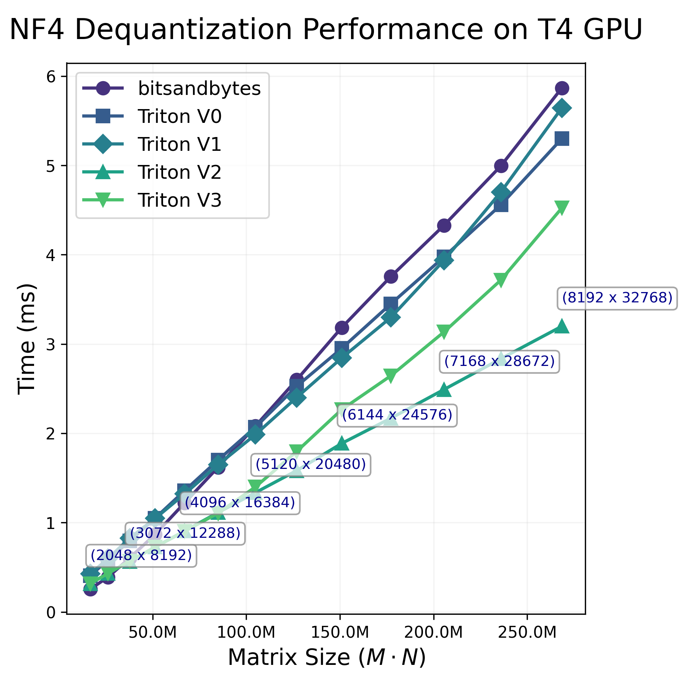
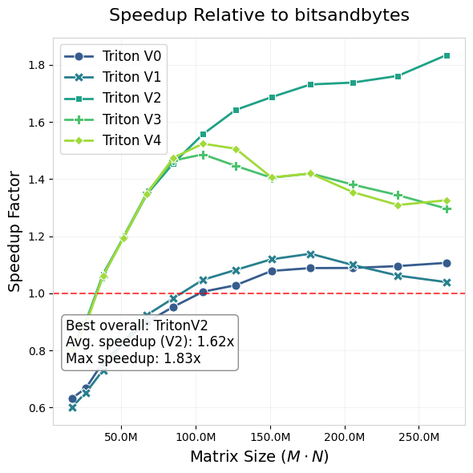

# QLoRA Dequantization Kernels in Triton

My attempts at a double-dequant kernel for QLoRA weights (see: [Unsloth Puzzles](https://colab.research.google.com/drive/1JqKqA1XWeLHvnYAc0wzrR4JBCnq43HyH?usp=sharing)). Results compared against `bitsandbytes` CUDA dequantization. See [my blog](https://lweitkamp.github.io/posts/qlora_dequantize/) post for more.

| Performance | Speedup |
| ----------- | ------- |
|  | |

